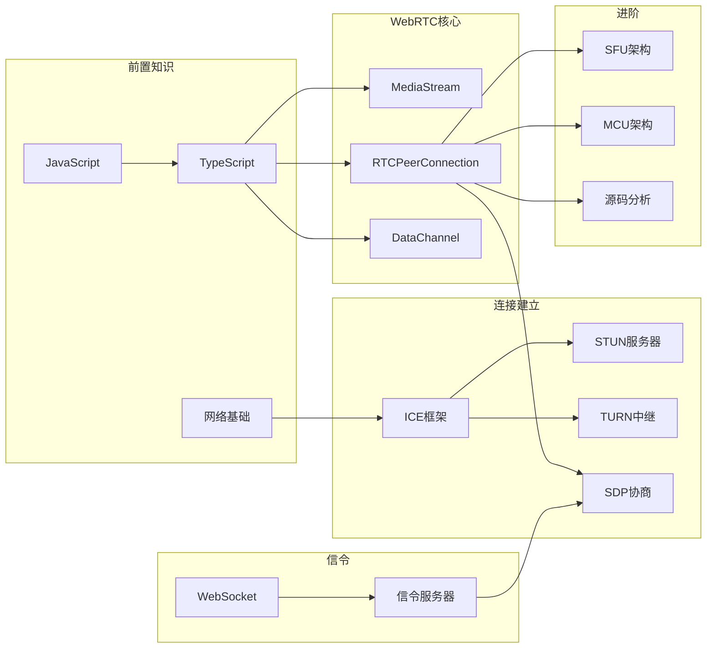

# 🕸️ WebRTC 知识图谱

## 📊 技术架构图

```
┌─────────────────────────────────────────────────────────┐
│                      应用层                              │
│  ┌─────────┐  ┌─────────┐  ┌─────────┐  ┌─────────┐    │
│  │ 视频通话 │  │ 直播连麦 │  │ 屏幕共享 │  │ 文件传输 │    │
│  └─────────┘  └─────────┘  └─────────┘  └─────────┘    │
└─────────────────────────────────────────────────────────┘
                          ↓↑
┌─────────────────────────────────────────────────────────┐
│                     WebRTC API                          │
│  ┌──────────────┐  ┌──────────────┐  ┌─────────────┐   │
│  │ MediaStream  │  │ RTCPeerConn  │  │ DataChannel │   │
│  └──────────────┘  └──────────────┘  └─────────────┘   │
└─────────────────────────────────────────────────────────┘
                          ↓↑
┌─────────────────────────────────────────────────────────┐
│                      会话管理                           │
│  ┌────────┐  ┌────────┐  ┌────────┐  ┌────────┐       │
│  │ SDP    │  │ ICE    │  │ STUN   │  │ TURN   │       │
│  └────────┘  └────────┘  └────────┘  └────────┘       │
└─────────────────────────────────────────────────────────┘
                          ↓↑
┌─────────────────────────────────────────────────────────┐
│                      网络传输                           │
│  ┌────────┐  ┌────────┐  ┌────────┐  ┌────────┐       │
│  │ UDP    │  │ TCP    │  │ SRTP   │  │ DTLS   │       │
│  └────────┘  └────────┘  └────────┘  └────────┘       │
└─────────────────────────────────────────────────────────┘
                          ↓↑
┌─────────────────────────────────────────────────────────┐
│                      编解码                             │
│  ┌────────┐  ┌────────┐  ┌────────┐  ┌────────┐       │
│  │ VP8/9  │  │ H.264  │  │ Opus   │  │ AAC    │       │
│  └────────┘  └────────┘  └────────┘  └────────┘       │
└─────────────────────────────────────────────────────────┘
```

---

## 🔗 知识关联图



---

## 📚 知识点清单

### 第一层：前置知识

| 知识点 | 重要性 | 掌握程度 | 笔记 |
|--------|--------|----------|------|
| JavaScript/ES6+ | ⭐⭐⭐⭐⭐ | ✅ 已掌握 | - |
| TypeScript | ⭐⭐⭐⭐⭐ | ✅ 已掌握 | [[03-Resources/前端开发/TypeScript/README\|查看]] |
| 网络协议 (TCP/UDP) | ⭐⭐⭐⭐ | 📚 学习中 | [[03-Resources/计算机基础/网络/README\|查看]] |
| HTTP/WebSocket | ⭐⭐⭐⭐ | ✅ 已掌握 | - |

### 第二层：API 层

| 知识点 | 重要性 | 掌握程度 | 笔记 |
|--------|--------|----------|------|
| MediaStream API | ⭐⭐⭐⭐⭐ | 📚 学习中 | 待创建 |
| RTCPeerConnection | ⭐⭐⭐⭐⭐ | 📚 学习中 | 待创建 |
| RTCDataChannel | ⭐⭐⭐⭐ | 📋 待学习 | 待创建 |
| 统计信息 API | ⭐⭐⭐ | 📋 待学习 | 待创建 |

### 第三层：连接建立

| 知识点 | 重要性 | 掌握程度 | 笔记 |
|--------|--------|----------|------|
| ICE 框架 | ⭐⭐⭐⭐⭐ | 📚 学习中 | 待创建 |
| STUN 协议 | ⭐⭐⭐⭐ | 📋 待学习 | 待创建 |
| TURN 协议 | ⭐⭐⭐⭐ | 📋 待学习 | 待创建 |
| SDP 格式 | ⭐⭐⭐⭐ | 📋 待学习 | 待创建 |

### 第四层：进阶

| 知识点 | 重要性 | 掌握程度 | 笔记 |
|--------|--------|----------|------|
| SFU 架构 | ⭐⭐⭐⭐⭐ | 📋 待学习 | 待创建 |
| WebRTC 源码 | ⭐⭐⭐⭐ | 📋 待学习 | 待创建 |
| 性能优化 | ⭐⭐⭐⭐ | 📋 待学习 | 待创建 |

---

## 🎯 学习路径

```
Week 1-2: 基础概念
├── WebRTC 概述
├── 音视频基础
└── 网络协议复习

Week 3-4: API 实践
├── MediaStream 获取媒体
├── 简单点对点通话
└── DataChannel 传输

Week 5-6: 深入理解
├── ICE/STUN/TURN
├── SDP 协商过程
└── 信令服务器实现

Week 7-8: 进阶实践
├── SFU 服务器搭建
├── 多人通话实现
└── 性能调优
```

---

## 🔗 相关笔记

```dataview
LIST
FROM "03-Resources/音视频开发/WebRTC"
WHERE file.name != "README"
```

---
#知识图谱/webrtc
