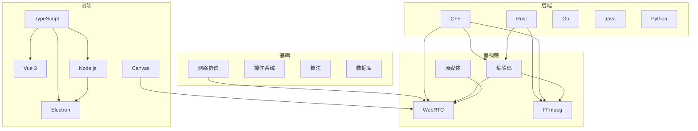

# 🕸️ 技术知识图谱

> 展示技术之间的关联与依赖关系

---

## 🎯 核心技术领域



---

## 🔗 知识依赖关系

### WebRTC 技术栈依赖

```
WebRTC (目标)
├── 前置知识
│   ├── JavaScript/TypeScript ⭐⭐⭐
│   ├── 网络协议 (TCP/UDP/STUN/TURN) ⭐⭐
│   ├── 音视频基础 ⭐⭐
│   └── Canvas/WebGL ⭐⭐
│
├── 核心技术
│   ├── MediaStream API
│   ├── RTCPeerConnection
│   ├── ICE/STUN/TURN
│   └── SDP 协商
│
└── 进阶
    ├── SFU 架构
    ├── 源码分析 (C++)
    └── 性能优化
```

### Rust 学习路径

```
Rust (目标)
├── 基础
│   ├── 所有权系统
│   ├── 借用检查
│   └── 生命周期
│
├── 进阶
│   ├── Trait 系统
│   ├── 异步编程
│   └── 宏编程
│
└── 应用
    ├── 音视频处理
    ├── Web 服务
    └── 系统编程
```

### 前端技术关联

```
前端开发
├── 基础层
│   ├── HTML/CSS
│   └── JavaScript
│
├── 类型层
│   └── TypeScript ──→ Vue/React/Electron
│
├── 框架层
│   ├── Vue 3
│   └── React
│
└── 应用层
    ├── Canvas (图形)
    ├── Electron (桌面)
    └── Node.js (全栈)
```

---

## 📊 技能树关联矩阵

| 技术 | WebRTC | FFmpeg | Electron | Rust | C++ | Go |
|------|--------|--------|----------|------|-----|-----|
| TypeScript | ⭐⭐⭐ | ⭐ | ⭐⭐⭐⭐⭐ | ⭐ | ⭐ | ⭐ |
| 网络 | ⭐⭐⭐⭐⭐ | ⭐⭐ | ⭐⭐ | ⭐⭐⭐ | ⭐⭐⭐ | ⭐⭐⭐⭐ |
| C++ | ⭐⭐⭐⭐ | ⭐⭐⭐⭐⭐ | ⭐⭐⭐ | ⭐⭐ | - | ⭐ |
| Rust | ⭐⭐⭐ | ⭐⭐⭐⭐ | ⭐⭐ | - | ⭐⭐ | ⭐⭐ |
| Canvas | ⭐⭐⭐⭐ | ⭐ | ⭐⭐⭐ | ⭐ | ⭐ | ⭐ |

> 关联强度: ⭐ 弱 → ⭐⭐⭐⭐⭐ 强

---

## 🎯 学习顺序推荐

### 路径一：音视频方向
```
1. TypeScript 基础 ──→ 2周
2. 网络协议基础 ──→ 1周
3. WebRTC API ──→ 3周
4. C++ 基础 ──→ 4周
5. WebRTC 源码 ──→ 持续
6. Rust + FFmpeg ──→ 持续
```

### 路径二：全栈方向
```
1. TypeScript ──→ 2周
2. Vue 3 ──→ 3周
3. Node.js ──→ 2周
4. Go/Rust 后端 ──→ 4周
5. Electron ──→ 2周
```

### 路径三：系统编程
```
1. Rust 基础 ──→ 4周
2. 操作系统概念 ──→ 2周
3. C++ 现代特性 ──→ 4周
4. 音视频编解码 ──→ 持续
```

---
#知识图谱
